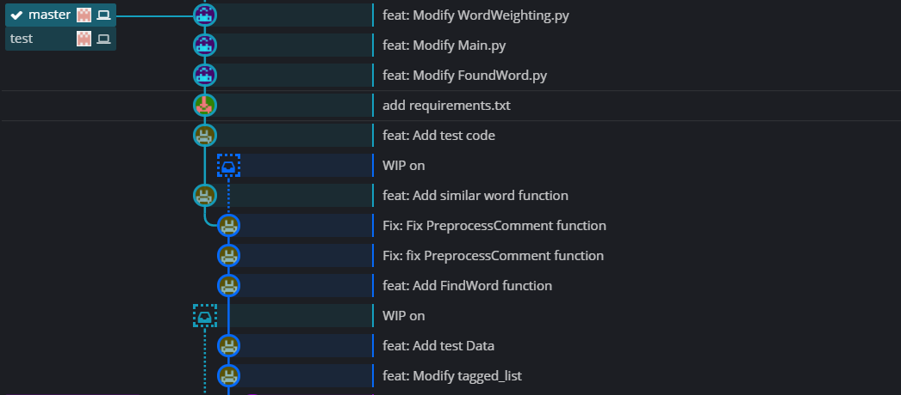
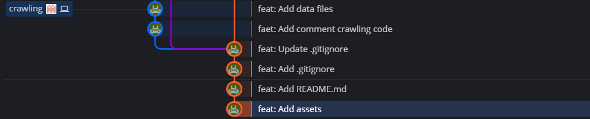
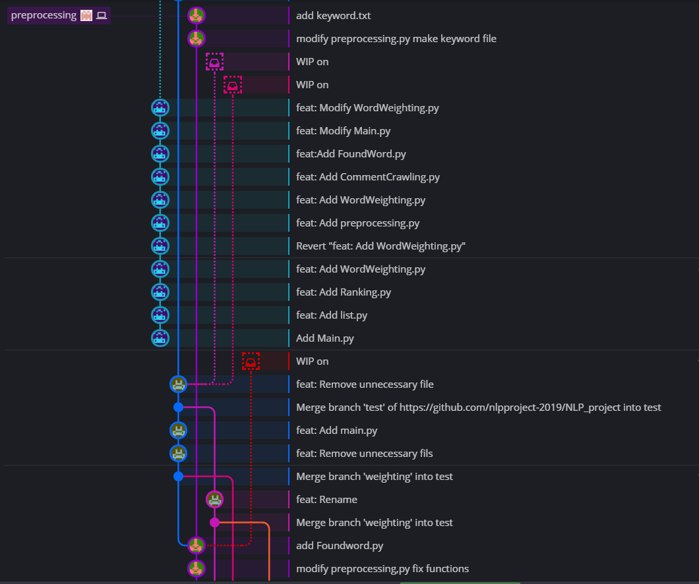
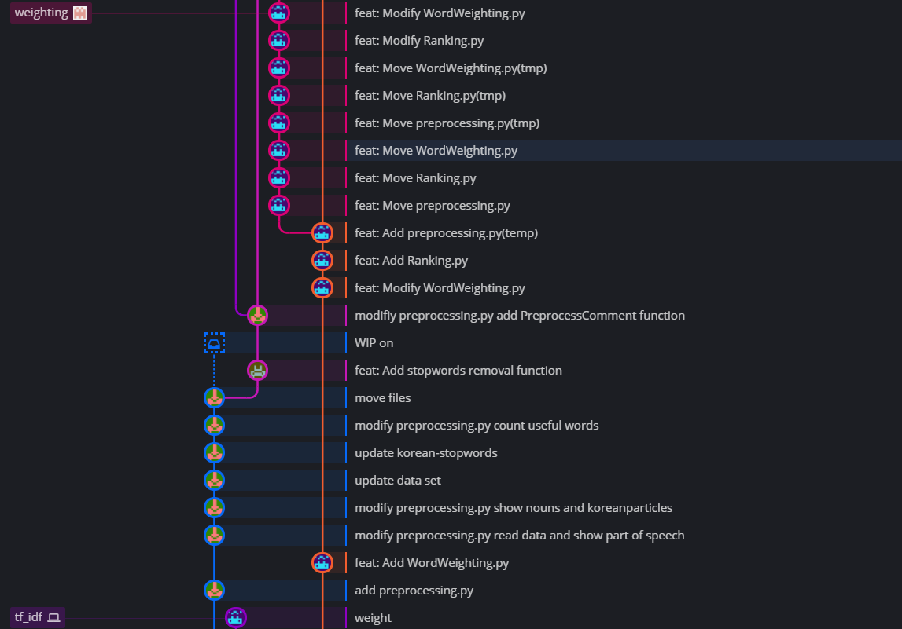

# CAU - NLP Project

## 프로젝트 주제

> 커뮤니티 댓글을 쓴 사용자의 연령대를 판별해주는 프로그램

## 개발 기간

> 2019.05.22 ~ 2019.06.14

## 팀원 구성

- [정인석](https://github.com/comisputer) - 팀장
- [이로히](https://github.com/rohi404)
- [정민준](https://github.com/minjoong507)

## 주요기술

- Web Crawling
- Keyword Extraction
- Natural Language Processing

## Requirement

- Requirement 설치
```bash
$ git clone https://github.com/nlpproject-2019/NLP_project
$ cd NLP_project
$ pip install -r requirement.txt
```
- 실행 명령어
```bash
$ cd NLP_project/src
$ python3 Main.py
```

## 진행 과정

- Master, test Branch

- Crawling Branch

- Preprocessing Branch

- Weighting Branch


## DETAIL

- 프로세스 입출력

- 프로세스 과정
1. Web Crawling
2. Preprocessing
3. Keyword Extracton
4. Ranking
5. Exception Handling
6. Evaluation

## License
- MIT License
